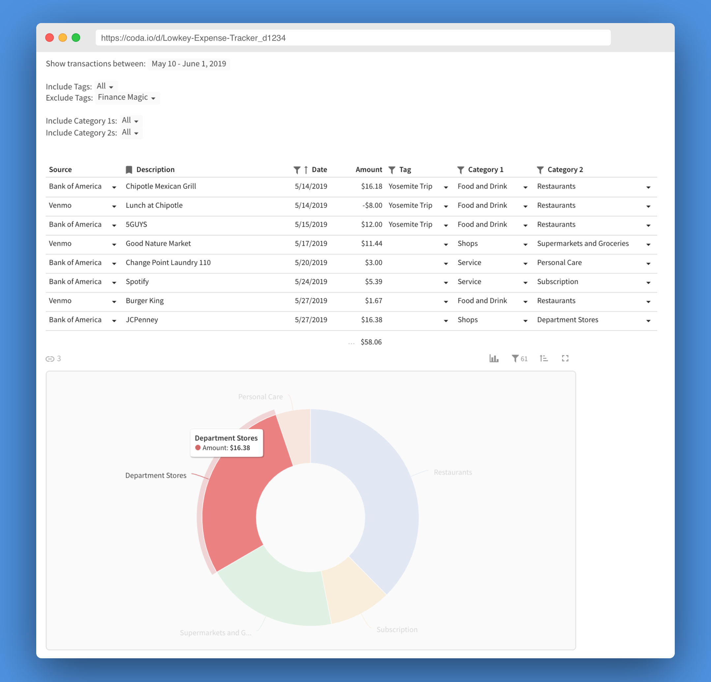

<h1 align="center">Parsley - a lowkey expense tracker</h1>

~flexible~ and ~lowkey~ tool that imports & tracks your <b>credit, debit, and Venmo expenses</b>

## Overview
The frontend is a doc on [Coda](http://coda.io) for your customization pleasure. The backend is the lightweight server in this repo which populates that Coda doc. The server has two endpoints, `/venmo` and `/plaid`. Each is triggered by a webhook for the corresponding type of transaction.

## Setup
Installing takes about 30 minutes. All services used are free.

### Set up the repo
1. Clone the repository locally.
2. Rename `.env.sample` to `.env`.

### Set Plaid webhook
The server provides a `/plaid` endpoint that will be triggered by Plaid when a new transaction posts in your bank account. Let's set the Plaid webhook URL:

If you'll be using Google App Engine to host, this means deciding a Google Cloud Project ID and checking on http://console.cloud.google.com that your chosen Project ID is avalable. Then, your webhook URL will be `http://[Google Cloud Project ID].appspot.com/plaid`. No need to set up hosting yet - just pick the Project ID so we have a webhook URL.

If you're hosting another way, your webhook URL will be `http://yourhostname.com/plaid`.

Save this webhook URL in your `.env` file as `PLAID_WEBHOOK_URL`. If you change your mind after completing the next section, you can update the webook with [a POST request](https://plaid.com/docs/#update-webhook) to the Plaid API.

### Plaid
Let's get connected to your bank. If you have multiple banks, I suggest connecting to the bank you do most of your transactions from as multiple banks are not yet supported. (PRs welcome!)

1. Sign up for the free development plan at [Plaid](https://plaid.com/).
2. Fill out the `PLAID_CLIENT_ID`, `PLAID_SECRET`, and `PLAID_PUBLIC_KEY` values in `.env` with values from your [Plaid dashboard](https://dashboard.plaid.com/overview/development).
3. Run `npm install`.
4. Now we'll connect to your financial institution to generate an access token. Run `npm run token-plaid bank`. This will start a local server which you can visit in your browser and go through the authentication flow. Once you've linked the bank, its associated access token will be saved in `.env`.
5. If you've done everything correctly, running `npm run test-plaid` now should print the recent transactions in your connected account.

### Coda
Let's set up the Coda frontend.
1. Sign up for a free account at [Coda](https://coda.io).
2. Make a personal copy of the [Coda frontend document](https://coda.io/d/Expense-Tracking-Template_d9CB0X3h_7N/Transactions_suGlF#_luEae). (Click the carrot in the top left next to the document name, and then "Copy Doc")
3. Now, let's get your copy's document ID. In the URL of your copy, there is a segment that looks like `.../Expense-Tracking-Template_d9CB0X3h_7N/...`. Everything between the `_d` and the trailing `/` of this segment is the ID. For example, in the URL of `https://coda.io/d/Expense-Tracking-Template_d9CB0X3h_7N/Transactions_suGlF#_luEae`, the ID is `9CB0X3h_7N`. **Note: the `_d` is not included in the document ID**
4. Fill out the `CODA_DOC_ID` in your `.env` file with this value.
5. Generate an Coda API token [here](https://coda.io/account). Copy the value into your `.env` as `CODA_API_KEY`.

### Test server
Let's test the bank and Coda integrations before moving on. (optional)
1. Run the server locally with `npm start`.
2. Open `http://localhost:8080/plaid`. You should recieve an OK response and the server logs should be free of errors.
3. The Transactions section in your Coda doc will be populated with your bank expenses from the past month. (This might take a minute or two to populate.)

### Host server
You can host the server however you'd like. Here are instructions for using the free tier of Google App Engine:
1. Create a Google App Engine project by completing steps 1-3 [here](https://cloud.google.com/nodejs/getting-started/hello-world)
2. Go to [Google Cloud Storage](https://console.cloud.google.com/storage/browser) and create a new bucket with any name that begins with `envvars-`. For example `envvars-[PROJECT ID]` is a good choice.
3. Upload your `.env` file to that bucket.
3. Run `gcloud app deploy` to deploy the server to
4. Browse to `http://[Google Cloud Project ID].appspot.com/plaid` and verify the response is "OK".

Your server is now running!

### Venmo
Finally, let's set up the Venmo integration that links your Gmail account with your server.
1. Make a free [Zapier](https://zapier.com) account.
2. Make a new Zap. For the "When This Happens": select the "Gmail" app, trigger event of "New Email Matching Search", and email search string of "from:venmo@venmo.com".
3. For the "Do This": select the "Webhooks by Zapier" app and action event of "POST".
4. In the "Post Customized" section, set the URL to the Venmo webhook. For Google App Engine, this is `http://[Google Cloud Project ID].appspot.com/venmo`.
5. Also in the "Post Customized" section: set Payload Type to Json, add data with key "body" and value "Step 1) Body Plain", add data  with key "subject" and value "Step 1) Subject".
6. Save your Zap and turn it on.

### Test Venmo
Venmo a friend some money, or ask them to Venmo you. You should see the transaction appear in your Transactions table several minutes after the Venmo transaction is completed. Congrats - you're ready to be fiscally responsible!

## Acknowledgements
Much of the server code, Plaid code, and overall structure is borrowed from [yyx990803/build-your-own-mint](https://github.com/yyx990803/build-your-own-mint). The idea for gathering Venmo transactions from email is borrowed from [this Medium post](https://medium.com/swlh/how-i-got-control-of-my-spending-with-a-couple-no-code-services-and-only-100-lines-of-python-code-36c8ac75f670) by Josh Peters. And my chosen method of loading environment variables in Google App Engine is borrowed from [this blog post](http://gunargessner.com/gcloud-env-vars/) by Gunar Gessner.
